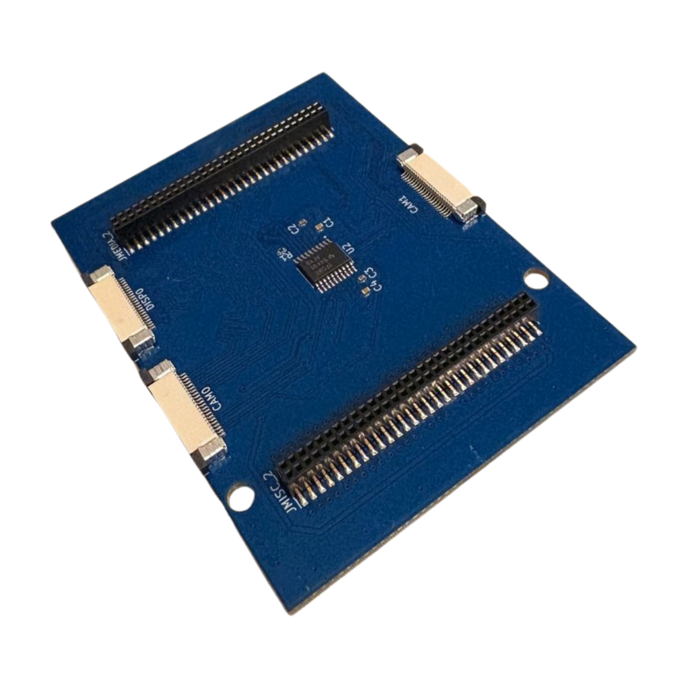

# Camera & Display Breakout for Arduino UNO Q
This camera and display module for the Arduino UNO Q. It breaks out the 2 MIPI-CSI cameras and a single MIPI-DSI display interace. All use a 22-pin cable (similar to compute boards for the Raspberry Pi).

[Purchase a pre-built camera & display board.](https://www.r1build.com/products/camera-and-display-breakout-for-arduino-uno-q)




## Connections
- 2 MIPI-CSI camera breakouts (22-pin flexible cable connector)
- 1 MIPI-DSI display breakout (22-pin flexible cable connector)
- 2 60-pin headers for interfacing with UNO Q
- 2 60-pin passthrough headers for future expansion

## Installation
In order to use the camera or display interfaces on the UNO Q, one must edit the device tree loaded at boot. Luckily, a device tree blob (DTB) for using a Raspberry Pi V2 Camera comes with the UNO Q. However, to use this board, some small edits must be made to that device tree. There is a shell script at `software/device_trees/setup_device.sh`. If you run this it will carry out the necessary steps in enabling the CAM0 connector for an IMX219 (Raspberry Pi V2 Camera Module). Right now, only the RPi V2 Camera is supported. Contributions are welcome!

To enable CAM0 for the IMX219, copy the `setup_device.sh` to somewhere safe on your UNO Q. The easiest way I've found is to SSH into the UNO Q using VS Code. Then just drag and drop the file into the UNO Q. Then, in your terminal, change to the directory where you have this file. Then, run:
```bash
sudo ./setup_device.sh

```
This file creates a final device tree file for you in a folder located in `/boot/efi/dtb/r1b`, where `r1b` stands for my website r1build.com. The final device tree blob is `qrb2210-arduino-imola-camera-rpiv2-r1b.dtb`. You should check to see if that file exists in the folder.

Next, you will need to point Linux to the right place for loading this file. To do so, you will need to find the `.conf` file that controls the boot. This file name seems to change for every update of the UNO Q. So, I have yet to find a way to standardize it yet. But, luckily, there is only one file with `.conf` in that location. That location is `/boot/efi/loader/entries/`. Go ahead and edit that file with the command:
```bash
sudo nano /boot/efi/loader/entries/(NameOfYourFile).conf
```
at the end of the file, add this line:
```bash
devicetree /dtb/r1b/qrb2210-arduino-imola-camera-rpiv2-r1b.dtb
```
This tells the Debian Linux to load our new device tree. Go ahead and reboot. Afterwards, your camera should be available.

THe shell script shows the basics
